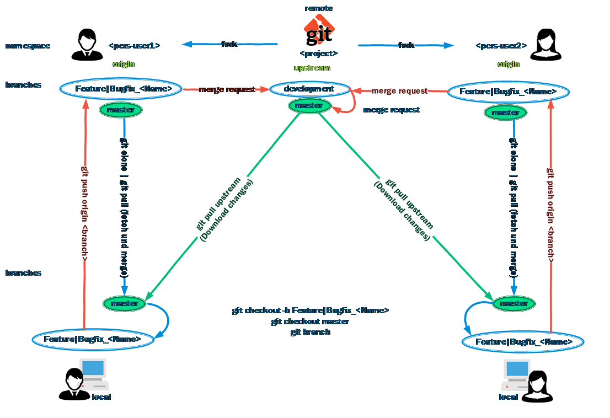

## Table of Contents

- [Table of Contents](#table-of-contents)
- [Git offline Installation](#git-offline-installation)
  - [Git Configuration](#git-configuration)
    - [List global settings](#list-global-settings)
    - [List system settings](#list-system-settings)
    - [Define identity with name and email](#define-identity-with-name-and-email)
    - [Proxy](#proxy)
  - [Work with Git](#work-with-git)
    - [Git clone](#git-clone)
    - [Update local repository](#update-local-repository)
    - [Add and upload changes](#add-and-upload-changes)
    - [List all local branches](#list-all-local-branches)
    - [Create new branch](#create-new-branch)
    - [Remove branch](#remove-branch)
- [See also](#see-also)

## Git offline Installation

VSCode integrates Git version control. Download and install Git.

[Download Source](https://git-scm.com/downloads)

### Git Configuration

Git global settings are saved in "$($env:USERPROFILE)\.gitconfig" while local settings are saved in the root folder of the respective project.

The global settings can be set from "$($env:USERPROFILE)\.gitconfig" to another path by setting the environment variable HOME to the desired path (Example: $env:home = 'D:\github').

#### List global settings

````powershell
git config --global -l
````

#### List system settings

````powershell
git config --system -l
````

these settings can only be changed with admin rights.

#### Define identity with name and email

````powershell
git config --global user.name "John Doe"
git config --global user.email johndoe@example.com
````

````powershell
[credential "https://github.com"]
     username = 'Tinu'

[credential]
     helper = wincred
````

#### Proxy

````powershell
[http "https://gitlab.company.int"]
	proxy = http://proxy.company.int:8080/

[credential]
	helper = wincred

[credential "https://gitlab.company.int"]
     username = 'Tinu'
````

### Work with Git



#### Git clone

````powershell
cd <your local working git folder>
git clone <git-url>
````

#### Update local repository

````powershell
cd <your local working git project>
git pull
````

#### Add and upload changes

````powershell
git add . | <file to add>
````

````powershell
git commit -m "Commit message"
````

````powershell
git push
````

#### List all local branches

````powershell
git branch
````

#### Create new branch

````powershell
git checkout -b <new_branch>
````

#### Remove branch

````powershell
$branch_to_delete = 'new_branch'
git checkout master
git push origin --delete $branch_to_delete
git branch -D $branch_to_delete
````

## See also

[git --fast-version-control](https://git-scm.com/doc).

[ [Top](#table-of-contents) ] [ [Blog](../categories.html) ]
