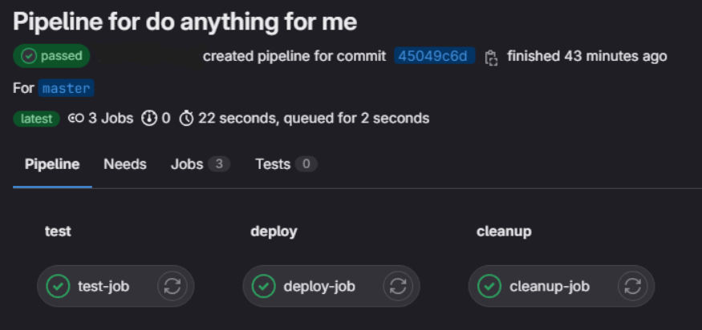
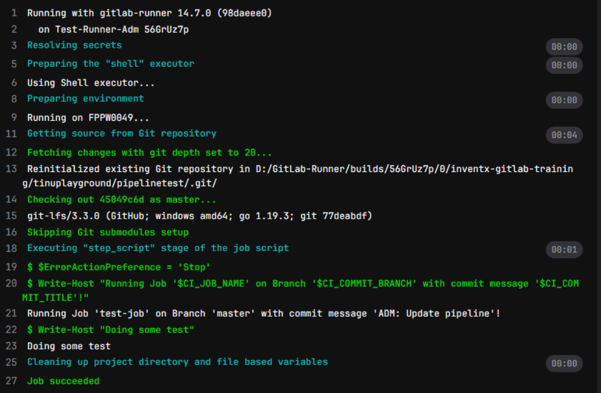
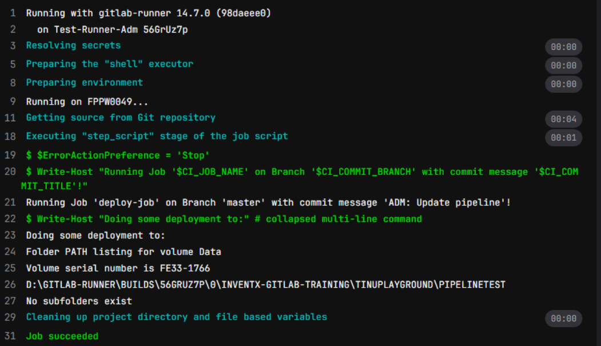
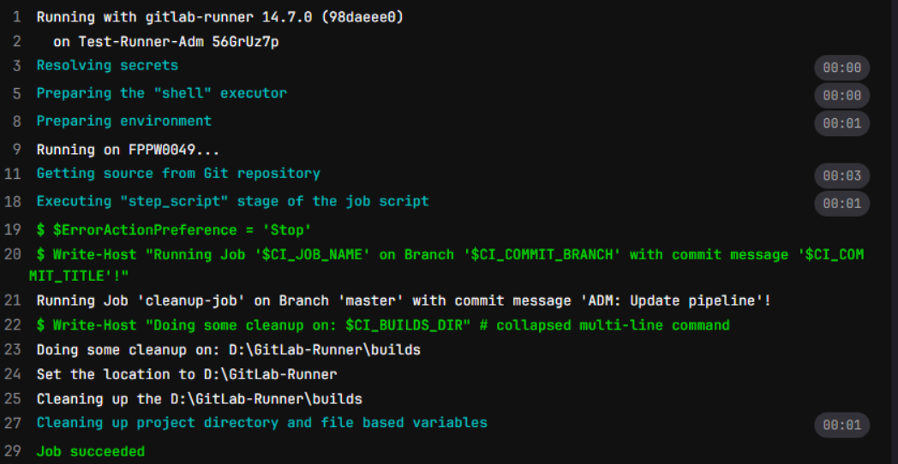

## Table of Contents

- [Table of Contents](#table-of-contents)
- [Rules](#rules)
- [Stages](#stages)
- [Jobs](#jobs)
- [Tags](#tags)
- [Extends](#extends)
- [Includes](#includes)
- [Script](#script)
- [Example 1](#example-1)
- [Example 2](#example-2)
- [Example 3](#example-3)
  - [gitlab-ci.yml](#gitlab-ciyml)
  - [test-node.yml](#test-nodeyml)
  - [deploy-job.yml](#deploy-jobyml)
  - [cleanup-runner.yml](#cleanup-runneryml)
  - [Pester Test Validate Input](#pester-test-validate-input)
  - [Pester Test Diplicated Values](#pester-test-diplicated-values)
    - [Pipeline TestJob](#pipeline-testjob)
    - [Pipeline DeployJob](#pipeline-deployjob)
    - [Pipeline CleanUpJob](#pipeline-cleanupjob)
- [Troubleshooting](#troubleshooting)
- [See also](#see-also)

GitLab Pipeline is your friend - UNDER CONSTRUCTION!



A GitLab CI/CD pipeline is the file ````.gitlab-ci.yml```` in the root of your project.

## Rules

````powershell
if: $CI_PIPELINE_SOURCE == 'merge_request_event'
if: $CI_COMMIT_BRANCH == $CI_DEFAULT_BRANCH
if: $CI_COMMIT_TITLE =~ /TEST:.*/
````

## Stages

List of stages for jobs, and their order of execution. If stages is not defined in the ````.gitlab-ci.yml```` file, the default pipeline stages are:

````powershell
.pre
build
test
deploy
.post
````

## Jobs

Hidden Jobs begins with a point in the name ````.cleanup_git````.

````powersehll
.cleanup_git:
  stage: .post
  script:
    - echo "Running Job $CI_JOB_NAME, $CI_COMMIT_BRANCH!"
````

Normal Job:

````powershell
test-node-yaml-test:
  rules:
    - if: $CI_COMMIT_TITLE =~ /TEST:.*/
  tags: [auto-deploy-test]
  extends: .test_node_yaml
````

## Tags

Tags of your GitLab-Runner.

## Extends

Reuse the configuration or Scripts.

````powersehll
extends: .test_node_yaml # included script
extends: .deploy_script  # hidden job
````

## Includes

Configurations and Scripts outside of the ````.gitlab-ci.yml````.

````powersehll
include: 
  - local: '/CI/init-env.yml'
  - local: '/CI/build-job.yml'
  - local: '/CI/test-job.yml'
  - local: '/CI/deploy-job.yml'
  - local: '/CI/cleanup-runner.yml'
````

## Script

A Script can be either a single Command or a Scriptblock.

Single Command:

````powershell
script:
  - echo "Running Job $CI_JOB_NAME, $CI_COMMIT_BRANCH!"
````

Scriptblock:

````powershell
script: |
  Write-Host "Start Job-ID $($CI_JOB_ID), Job-Name $($CI_JOB_NAME)"
  if(-not(Test-Path D:\Pikett-Scripts)){
    New-Item D:\Pikett-Scripts -ItemType Directory -Force | Select LastWriteTime, Length, Name, Fullname
  }
  Copy-Item "*.ps1" "D:\Pikett-Scripts" -PassThru -Force | Select LastWriteTime, Length, Name, Fullname
  if($LastExitCode -gt 0) { Throw "LastExitCode $($LastExitCode)" }
  Write-Host "End Job-ID $($CI_JOB_ID), Job-Name $($CI_JOB_NAME)"
````

[ [Top](#table-of-contents) ]

## Example 1

A very simple Pipeline.

````powershell
# A pipeline is composed of independent jobs that run scripts, grouped into stages.
# Stages run in sequential order, but jobs within stages run in parallel.
# For more information, see: https://docs.gitlab.com/ee/ci/yaml/index.html#stages

workflow:
  name: 'Pipeline for do anything for me'
  rules:
    - if: $CI_PIPELINE_SOURCE == 'merge_request_event'
    - if: $CI_COMMIT_BRANCH == $CI_DEFAULT_BRANCH  

stages:
  - test
  - deploy
  - cleanup

.execute_script:
  before_script:
    - Write-Host "Running Job '$CI_JOB_NAME' on Branch '$CI_COMMIT_BRANCH' with commit message '$CI_COMMIT_TITLE'!"

test-job:
  stage: test
  tags: [test-win-adm]
  extends: .execute_script
  script:
    - Write-Host "Doing some test"

deploy-job:
  stage: deploy
  tags: [test-win-adm]
  extends: .execute_script
  script: |
    Write-Host "Doing some deployment to:"
    $ProjectFullname = Get-Item $CI_PROJECT_DIR
    tree /A ($ProjectFullname.FullName).ToLower()

cleanup-job:
  stage: cleanup
  tags: [test-win-adm]
  extends: .execute_script
  script: |
    Write-Host "Doing some cleanup on: $CI_BUILDS_DIR"
    $SplittedPath = $CI_BUILDS_DIR -split '\\'
    $RootPath = Join-Path -Path $SplittedPath[0] -ChildPath $SplittedPath[1]
    Write-Host "Set the location to $RootPath"
    Set-Location $RootPath
    $CleaningPath = Join-Path -Path $RootPath -ChildPath $SplittedPath[2]
    Write-Host "Cleaning up the $CleaningPath"
    Remove-Item $CleaningPath -Recurse -Force
````

[ [Top](#table-of-contents) ]

## Example 2

Copy items to the Runner in a specified target path.

````powershell
workflow:
  name: 'Pipeline to deploy any Pikett-Scripts to the Script-Host'

stages:
  - build
  - test

.deploy_script: 
    stage: build
    only:
      - master
    script: |
      Write-Host "Start Job-ID $($CI_JOB_ID), Job-Name $($CI_JOB_NAME)"
      Write-Host "Currently do only git pull"
      if(-not(Test-Path D:\Pikett-Scripts)){
        New-Item D:\Pikett-Scripts -ItemType Directory -Force | Select LastWriteTime, Length, Name, Fullname
      }
      Copy-Item "*.ps1" "D:\Pikett-Scripts" -PassThru -Force | Select LastWriteTime, Length, Name, Fullname
      if($LastExitCode -gt 0) { Throw "LastExitCode $($LastExitCode)" }
      Write-Host "End Job-ID $($CI_JOB_ID), Job-Name $($CI_JOB_NAME)"

deploy-cloud:  # This job runs in the build stage, which runs first of defined stages.
  tags: [pikett-cloud]
  extends: .deploy_script
````

[ [Top](#table-of-contents) ]

## Example 3

This Pipeline does only execute if the commit message starts with TEST:.  
Execute Pester-Tests, upload the report as artifact back to the Git-Repository.

### gitlab-ci.yml

````powershell
# A pipeline is composed of independent jobs that run scripts, grouped into stages.
# Stages run in sequential order, but jobs within stages run in parallel.
# For more information, see: https://docs.gitlab.com/ee/ci/yaml/index.html#stages

workflow:
  rules:
    - if: $CI_PIPELINE_SOURCE == "merge_request_event"
    - if: $CI_COMMIT_BRANCH && $CI_OPEN_MERGE_REQUESTS
      when: never

stages: # List of stages for jobs, and their order of execution
  - build
  - test
  - deploy

include: 
  - local: '/CI/test-node.yml'
  - local: '/CI/deploy-job.yml'
  - local: '/CI/cleanup-runner.yml'

# Run stage deploy and cleanup for commit TEST only the test runner
test-node-yaml-test:
  rules:
    - if: $CI_COMMIT_TITLE =~ /TEST:.*/
  tags: [auto-deploy-test]
  extends: .test_node_yaml

deploy-job-test:
  rules:
    - if: $CI_COMMIT_TITLE =~ /TEST:.*/
  tags: [auto-deploy-test]
  extends: .deploy_job

cleanup-runner-test:
  rules:
    - if: $CI_COMMIT_TITLE =~ /TEST:.*/
  tags: [auto-deploy-test]
  extends: .cleanup_runner
````

[ [Top](#table-of-contents) ]

### test-node.yml

````powershell
.test_node_yaml:  # This job runs in the test stage, which runs second of defined stages.
  stage: test
  script: |
    Write-Host "Start Job-ID $($CI_JOB_ID), Job-Name $($CI_JOB_NAME)"

    Write-Host "Initialize Modules"
    Get-Module -Listavailable psyml, pester | Select Name,Version | Out-String
    Write-Host "Import Modules"
    Import-Module -Name psyml
    Import-Module -Name Pester -MinimumVersion 5.3.3

    Write-Host "Initialize path-variable"
    $ParentLocation  = Get-Location | Select -ExpandProperty Path
    $ReportsPath     = Join-Path -Path $ParentLocation -ChildPath 'Reports'
    $TestsPath       = Join-Path -Path $ParentLocation -ChildPath 'Tests'
    $BinPath         = Join-Path -Path $ParentLocation -ChildPath 'Bin'
    $ReadmeFullName  = Join-Path -Path $ParentLocation -ChildPath 'README.md'
    $NReportFullName = Join-Path -Path $ReportsPath -ChildPath 'Last-TestsReport.NUnitXml'
    $JReportFullName = Join-Path -Path $ReportsPath -ChildPath 'Last-TestsReport.JUnit.Xml'

    Write-Host "Run Pester Tests"
    $config = [PesterConfiguration]::Default
    $config.Run.Path           = $TestsPath
    $config.Filter.Tag         = "Required"
    $config.Output.Verbosity   = 'Normal'
    $config.Run.PassThru       = $true
    $config.Run.Throw          = $true
    $NUnitReport = Invoke-Pester -Configuration $config

    Write-Host "Create Last-TestsReport.NUnitXml"
    if(-not(Test-Path $ReportsPath)){
      $null = New-Item -Path $ReportsPath -ItemType Directory
    }
    $NUnitReport | Export-NUnitReport -Path $NReportFullName
    $NUnitReport | Export-JUnitReport -Path $JReportFullName

    Get-ChildItem $ReportsPath | Select LastWriteTime, Length, Name, Fullname | Format-List

    if($LastExitCode -gt 0) { Throw "LastExitCode $($LastExitCode)" }
    Write-Host "End Job-ID $($CI_JOB_ID), Job-Name $($CI_JOB_NAME)"

  artifacts:
    when: always
    paths:
      - Reports/Last-TestsReport.JUnit.Xml
    reports:
      junit: Reports/Last-TestsReport.JUnit.Xml
    expire_in: 2 days
````

[ [Top](#table-of-contents) ]

### deploy-job.yml

````powershell
.deploy_job:  # This job runs in the deploy stage, which runs third of defined stages.
  stage: deploy
  script: | 
    Write-Host "Start Job-ID $($CI_JOB_ID), Job-Name $($CI_JOB_NAME)"

    $ParentLocation   = Get-Location | Select -ExpandProperty Path
    $NodeFolder       = Join-Path -Path $ParentLocation -ChildPath 'Nodes'
    $TemplateFolder   = Join-Path -Path $ParentLocation -ChildPath 'Templates'
    $AutoDeployFolder = Join-Path -Path $TemplateFolder -ChildPath 'AutoDeploy'
    $BinPath          = Join-Path -Path $ParentLocation -ChildPath 'Bin'
    $yamlpath         = Join-Path -Path $NodeFolder -ChildPath '*.yml'
    $yamlfile         = Get-ChildItem $yamlpath

    foreach($item in $yamlfile){
      $node = Get-Content -Path $item.FullName | ConvertFrom-Yaml
      if($node.Status -match 'new'){
        Write-Host "New node $($item.Name)"
        switch($node.DeployType){
          'AutoDeploy' {
            Write-Host "DeployType $($node.DeployType)"
            Write-Host $node | Out-String | Format-List
            #$NodeCsv = "$($node.ESXiHost.ToUpper()).csv"
            if(-not(Test-Path $AutoDeployFolder)){
              New-Item -Path $AutoDeployFolder -ItemType Directory -Force | Select-Object LastWriteTime, Name, Fullname | Format-List
            }
            #$node | ConvertTo-Csv -NoTypeInformation | Out-File -FilePath $(Join-Path -Path $AutoDeployFolder -ChildPath $NodeCsv) -Encoding utf8 -Force
            $NodeYml = "$($node.ESXiHost.ToLower()).yml"
            $node | ConvertTo-Yaml -AsArray | Out-File -FilePath $(Join-Path -Path $AutoDeployFolder -ChildPath $NodeYml) -Encoding utf8 -Force
            Copy-Item $(Join-Path -Path $BinPath -ChildPath 'Execute-Workflow.ps1') -Destination $AutoDeployFolder -Force -PassThru | Select-Object LastWriteTime, Length, Name, Fullname | Format-List
            Copy-Item $(Join-Path -Path $BinPath -ChildPath 'Set-BmcSettings.ps1') -Destination $AutoDeployFolder -Force -PassThru | Select-Object LastWriteTime, Length, Name, Fullname | Format-List
            Copy-Item $(Join-Path -Path $BinPath -ChildPath 'Prep-CisHardening.ps1') -Destination $AutoDeployFolder -Force -PassThru | Select-Object LastWriteTime, Length, Name, Fullname | Format-List
          }
        }
      }
      if($node.Status -match 'done'){
        Write-Host "Node already done $($item.Name)"
      }
    }
    Write-Host "End Job-ID $($CI_JOB_ID), Job-Name $($CI_JOB_NAME)" 

  artifacts:
    when: always
    paths:
      - Templates/AutoDeploy/*.yml
      - Templates/AutoDeploy/*.ps1
    expire_in: 1 days
````

[ [Top](#table-of-contents) ]

### cleanup-runner.yml

````powershell
.cleanup_runner: # This job runs in the .post stage, which runs last.
  stage: .post
  script: |
    Write-Host "Start Job-ID $($CI_JOB_ID), Job-Name $($CI_JOB_NAME)"
    $array = $CI_PROJECT_DIR -split '\\'
    $RootPath = $(Join-Path -Path $array[0] -ChildPath $array[1])
    $Target = Join-Path $RootPath -ChildPath 'Templates'

    Write-Host "RootPath $($RootPath)"
    Write-Host "Target $($Target)"
    
    if(Test-Path $Target){
      Get-ChildItem $Target
      Remove-Item -Path $Target -Recurse -Force -Confirm:$false
    }

    Write-Host "Do copy"
    Copy-Item -Path $(Join-Path -Path $CI_PROJECT_DIR -ChildPath Templates) -Destination $RootPath -Recurse -Force -Whatif
    Copy-Item -Path $(Join-Path -Path $CI_PROJECT_DIR -ChildPath Templates) -Destination $RootPath -Recurse -Exclude '.gitkeep' -Force -Confirm:$false -PassThru
    
    Write-Host "After copy"
    Get-ChildItem $Target
    
    Write-Host "Do cleanup"
    $CleanupPath = $(Join-Path -Path $array[0] -ChildPath $(Join-Path -Path $array[1] -ChildPath $array[2]))
    Set-Location $RootPath
    Get-Location | Select -ExpandProperty Path | Out-String
    if(Test-Path $CleanupPath){
      Remove-Item -Path $CleanupPath -recurse -force -Confirm:$false
    }

    if($LastExitCode -gt 0) { Throw "LastExitCode $($LastExitCode)" }
    Write-Host "End Job-ID $($CI_JOB_ID), Job-Name $($CI_JOB_NAME)"
````

[ [Top](#table-of-contents) ]

### Pester Test Validate Input

````powershell
BeforeDiscovery {
    $RootFolder = $PSScriptRoot | Split-Path -Parent
    $NodeFolder = Join-Path -Path $RootFolder -ChildPath 'Nodes'
    $yamlpath   = Join-Path -Path $NodeFolder -ChildPath '*.yml'
    $yamlfile   = Get-ChildItem $yamlpath
}

Describe "Validate Input from <_.Name>" -Tag 'Required' -ForEach $yamlfile {

    BeforeAll{
        $yamlobject = get-content $_.FullName | ConvertFrom-Yaml
    }

    It "[POS] The Property ESXiHost should contains characters and numbers" {
        $($yamlobject.ESXiHost) | Should -Match "\w+\d+"
    }
    It "[POS] The Property IPv4Address should contains IPv4Address" {
        $($yamlobject.IPv4Address) | Should -Match '^((25[0-5]|2[0-4][0-9]|[01]?[0-9][0-9]?)\.){3}(25[0-5]|2[0-4][0-9]|[01]?[0-9][0-9]?)'
    }
    It "[POS] The Property SubnetMask should contains Subnet mask" {
        $($yamlobject.SubnetMask) | Should -Match '^(((255\.){3}(255|254|252|248|240|224|192|128+))|((255\.){2}(255|254|252|248|240|224|192|128|0+)\.0)|((255\.)(255|254|252|248|240|224|192|128|0+)(\.0+){2})|((255|254|252|248|240|224|192|128|0+)(\.0+){3}))$'
    }
    It "[POS] The Property DefaultGateway should contains IPv4Address" {
        $($yamlobject.DefaultGateway) | Should -Match '^((25[0-5]|2[0-4][0-9]|[01]?[0-9][0-9]?)\.){3}(25[0-5]|2[0-4][0-9]|[01]?[0-9][0-9]?)'
    }
    It "[POS] The Property PrimaryDNSServer should contains IPv4Address" {
        $($yamlobject.PrimaryDNSServer) | Should -Match '^((25[0-5]|2[0-4][0-9]|[01]?[0-9][0-9]?)\.){3}(25[0-5]|2[0-4][0-9]|[01]?[0-9][0-9]?)'
    }
    It "[POS] The Property SecondaryDNSServer should contains IPv4Address" {
        $($yamlobject.SecondaryDNSServer) | Should -Match '^((25[0-5]|2[0-4][0-9]|[01]?[0-9][0-9]?)\.){3}(25[0-5]|2[0-4][0-9]|[01]?[0-9][0-9]?)'
    }
    It "[POS] The Property Status should contains done or new" {
        $($yamlobject.Status) | Should -Match 'done|new'
    }
    It "[POS] The Property DeployType should contains Manual, AutoDeploy or Kickstart" {
        $($yamlobject.DeployType) | Should -Match 'Manual|AutoDeploy|Kickstart'
    }
    It "[POS] The Property InstallType should contains cleanup or new" {
        $($yamlobject.InstallType) | Should -Match 'cleanup|new'
    }
    It "[POS] The Property vCenter should exists" {
        $($yamlobject.vCenter) | Should -Match '\w+\d+'
    }
}
````

[ [Top](#table-of-contents) ]

### Pester Test Diplicated Values

````powershell
Describe "Test for duplicated values" -Tag 'Required' {

    BeforeAll {
        $RootFolder = $PSScriptRoot | Split-Path -Parent
        $NodeFolder = Join-Path -Path $RootFolder -ChildPath 'Nodes'

        function Get-DuplicatedValue {
            [CmdletBinding()]
            param(
                [Parameter(
                    Mandatory=$true,
                    ValueFromPipeline=$true,
                    ValueFromPipelineByPropertyName=$true,
                    Position = 0
                )]
                [String]$Filed
            )
    
            # Duplicated fields
            #Import-Module "$($env:ProgramFiles)\PowerShell\Modules\psyml"
            $Nodes = foreach($node in (Get-ChildItem $NodeFolder )){
                Get-Content -Path $node.FullName | ConvertFrom-Yaml
            }
            $ret = foreach($item in ($Nodes.$Filed | Group-Object)){
                if($item.count -gt 1){
                    $item.Name
                }
            }
            return $ret
        }
    }

    It "[POS] <_> should not have duplicated values" -ForEach 'ESXiHost', 'IPv4Address', 'vMotionIPv4Address', 'MacAddress', 'BmcIPaddress', 'BmcMacAddress' {
        Get-DuplicatedValue -Filed $_ | Should -BeNullOrEmpty
    }
}
````

[ [Top](#table-of-contents) ]

#### Pipeline TestJob



#### Pipeline DeployJob



#### Pipeline CleanUpJob



## Troubleshooting

Ensure that you do not have any try-catch in your PowerShell-code.

````powershell

````

## See also

[CI/CD pipelines](https://docs.gitlab.com/ee/ci/pipelines/) on GitLab docs

[ [Top](#table-of-contents) ] [ [Blog](../categories.html) ]
