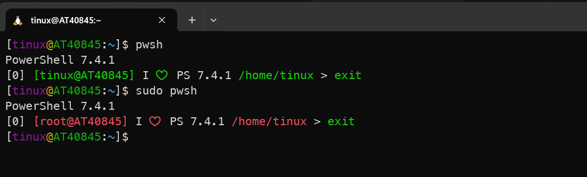
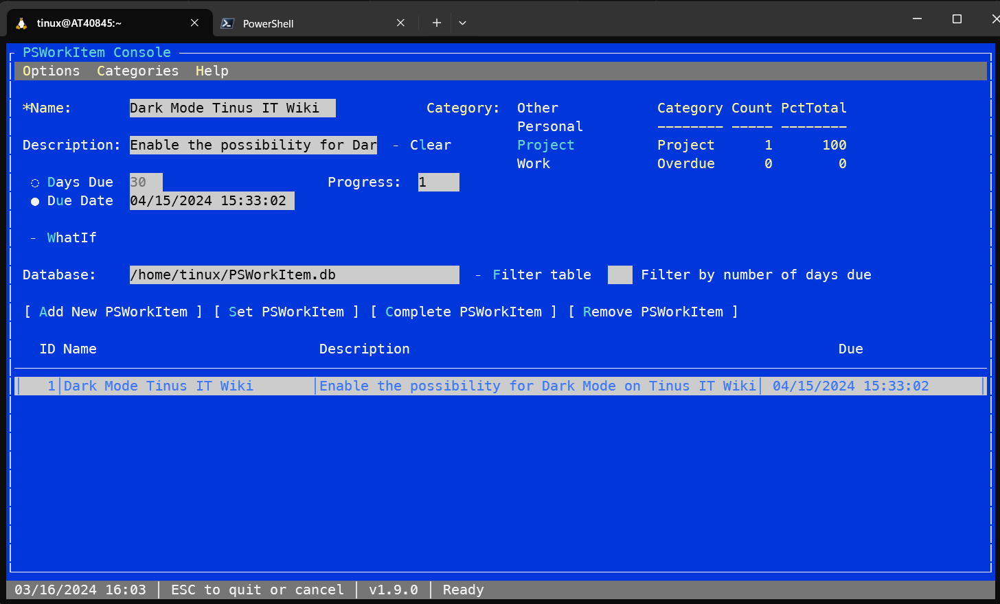

The magic differents of Mac, Linux and Windows if you working with PowerShell.

## Table of Contents

- [Table of Contents](#table-of-contents)
- [Windwos Subsystem for Linux](#windwos-subsystem-for-linux)
  - [List valid distributions](#list-valid-distributions)
  - [Install a Linux](#install-a-linux)
  - [Uninstall a Linux](#uninstall-a-linux)
  - [Transfer data between Windows and WSL](#transfer-data-between-windows-and-wsl)
- [See also](#see-also)

## Windows Subsystem for Linux

Using the Windows Subsystem for Linux on Windows 11 to play around with Linux.

### List valid distributions

````bash
wsl --list --online

The following is a list of valid distributions that can be installed.
Install using 'wsl.exe --install <Distro>'.

NAME                                   FRIENDLY NAME
Ubuntu                                 Ubuntu
Debian                                 Debian GNU/Linux
kali-linux                             Kali Linux Rolling
Ubuntu-18.04                           Ubuntu 18.04 LTS
Ubuntu-20.04                           Ubuntu 20.04 LTS
Ubuntu-22.04                           Ubuntu 22.04 LTS
OracleLinux_7_9                        Oracle Linux 7.9
OracleLinux_8_7                        Oracle Linux 8.7
OracleLinux_9_1                        Oracle Linux 9.1
openSUSE-Leap-15.5                     openSUSE Leap 15.5
SUSE-Linux-Enterprise-Server-15-SP4    SUSE Linux Enterprise Server 15 SP4
SUSE-Linux-Enterprise-15-SP5           SUSE Linux Enterprise 15 SP5
openSUSE-Tumbleweed                    openSUSE Tumbleweed
````

### Install a Linux

````bash
wsl --install Ubuntu-22.04
````

### Uninstall a Linux

````bash
wsl --unregister Ubuntu-22.04
````

### Install PowerShell on Ubuntu

````bash
sudo apt-get update
sudo apt-get install -y wget apt-transport-https software-properties-common
wget -q "https://packages.microsoft.com/config/ubuntu/$(lsb_release -rs)/packages-microsoft-prod.deb"
sudo dpkg -i packages-microsoft-prod.deb
sudo apt-get update && sudo apt-get install -y powershell
````

### Install PowerShell on AlmaLinux

*To install AlmaLinux, open Microsoft Store, search for AlmaLinux 9 and install it. It's not available as WSL-Distribution*

````bash
sudo dnf clean all && sudo dnf update && sudo dnf --security update
curl https://packages.microsoft.com/config/rhel/9.0/prod.repo | sudo tee /etc/yum.repos.d/microsoft.repo
sudo dnf install --assumeyes powershell
````

### Login on AlmaLinux

Start the Windows Terminal and Open AlmaLinux-OS 9 as a new tab.



### Transfer data between Windows and WSL

List the local drives on Windows from the Linux:

````bash
ls /mnt
````

````bash
c  d  e  f  wsl  wslg  z
````

List the content of a specified path on Windows from the Linux:

````bash
ls /mnt/d/temp
````

Copy the profile.ps1 from Windows to Linux for all users:

````bash
mkdir -p /home/tinux/.config/powershell
sudo cp -f -R /mnt/d/profile.ps1 /opt/microsoft/powershell/7/
````

### Install Modules on AlmaLinux

First, set the PSGallery as trusted then you can install the modules without to confirm that you trust the repository.

````powershell
Set-PSRepository -Name PSGallery -InstallationPolicy Trusted -SourceLocation https://www.powershellgallery.com/api/v2

Get-PSRepository

Name                      InstallationPolicy   SourceLocation
----                      ------------------   --------------
PSGallery                 Trusted              https://www.powershellgallery.com/api/v2
````

Start PowerShell as root to install the modules for all users.

````bash
sudo pwsh
````

````powershell
Install-Module -Scope AllUsers -Verbose -Name PSReadLine
Install-Module -Scope AllUsers -Verbose -Name mySQLite
Install-Module -Scope AllUsers -Verbose -Name PSWorkItem
````

Initialize PSWorkItem and start the TUI Console.

````powershell
Initialize-PSWorkItemDatabase

Add-PSWorkItemCategory -Category Work -Description "business-related tasks" -PassThru -Force
Add-PSWorkItemCategory -Category Personal -Description "personal-related tasks" -PassThru -Force
Add-PSWorkItemCategory -Category Project -Description "project-related tasks" -PassThru -Force
Add-PSWorkItemCategory -Category Other -Description "something-related tasks" -PassThru -Force

Open-PSWorkItemConsole
````

or direct from bash

````bash
pwsh -Command "& {wic}"
````



## See also

[Getting Started with PowerShell in Linux](https://www.tecmint.com/install-powershell-in-linux/), 
[AlamLinux Wiki](https://wiki.almalinux.org/documentation/after-installation-guide.html),
[Jeff Hicks PSWorkItem](https://github.com/jdhitsolutions/PSWorkItem)
