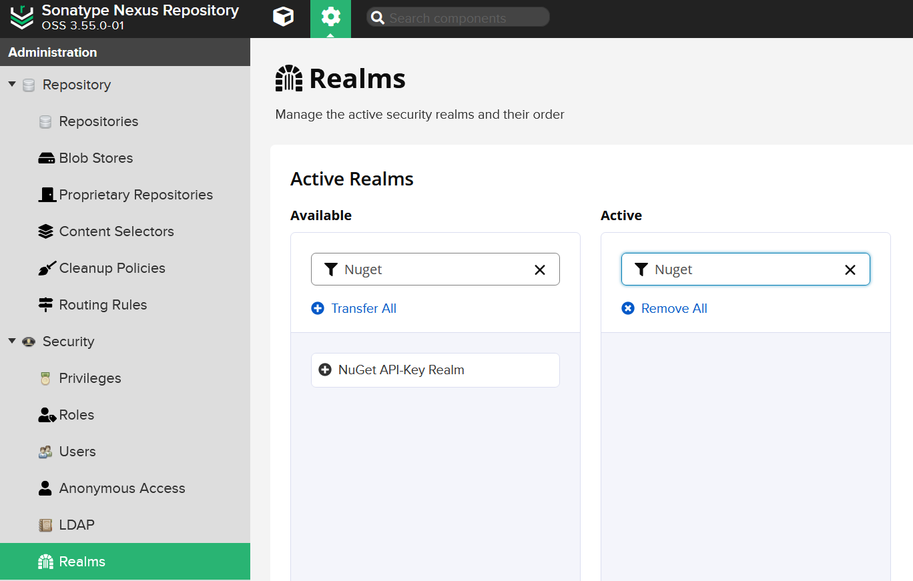
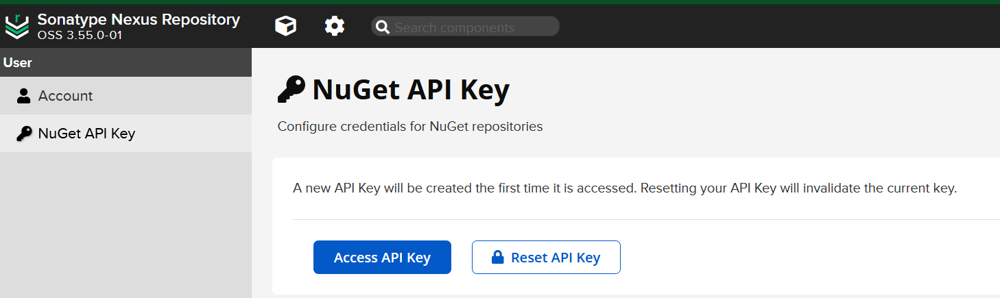
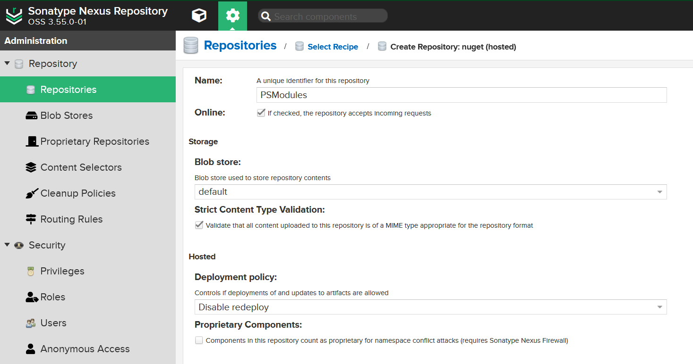

# Table of Contents

- [Table of Contents](#table-of-contents)
- [File Share PowerShellGet Repositories](#file-share-powershellget-repositories)
    - [Requirements](#requirements)
    - [Creating a local repository](#creating-a-local-repository)
    - [Registering a local repository](#registering-a-local-repository)
- [Sonatype Nexus Repository](#sonatype-nexus-repository)
    - [Using Docker](#using-docker)
    - [Create a user](#create-a-user)
        - [Activate NuGet API Key](#activate-nuget-api-key)
    - [Create Nuget Repositories](#create-nuget-repositories)
    - [Registering Repository to nexus container](#registering-repository-to-nexus-container)
- [Use the Repository](#use-the-repository)
    - [Publish a Module to the file share-based repository](#publish-a-module-to-the-file-share-based-repository)
    - [Publish a Module to the nexus repository](#publish-a-module-to-the-nexus-repository)
    - [Use the Module](#use-the-module)
    - [Prepare a Script to publish](#prepare-a-script-to-publish)
    - [Publish a Script for file share-based repositories](#publish-a-script-for-file-share-based-repositories)
    - [Publish a Script for nexus repository](#publish-a-script-for-nexus-repository)
    - [Use the script](#use-the-script)
- [See also](#see-also)

# File Share PowerShellGet Repositories

It's possible to work with local, private PowerShellGet Repositories! The File Share Repository is the simplest way to work with local, private Repositories.

## Requirements

NuGet.exe must be available in:
  - C:\ProgramData\Microsoft\Windows\PowerShell\PowerShellGet\ or
  - C:\Users\<yourAccount>\AppData\Local\Microsoft\Windows\PowerShell\PowerShellGet\
  - NuGet.exe can be downloaded from https://aka.ms/psget-nugetexe

Microsoft.PackageManagement.NuGetProvider.dll must be available in:
  - C:\Program Files\PackageManagement\ProviderAssemblies\nuget\2.8.5.208

PowerShell Modules:
  - PackageManagement 1.4.7
  - PowerShellGet 2.2.5

Download the Requirements from this site as [PowerShellGetForOffline.zip](https://tinuwalther.github.io/bin/PowerShellGetForOffline.zip):

|Name|Size|SHA256|
|-|-|-|
|PowerShellGetForOffline.zip|3427528 bytes (3347 KiB)|B430D703B08D0167D013DFD8E2DDF466D69BD37E827E67AEEAE99A178F57F49A|

## Creating a local repository

Create a new share on your NAS or something like that.

## Registering a local repository

Register your new share as a PowerShellGet Repository

````powershell
$LocalGallery = @{
    Name                 = "LocalGallery"
    SourceLocation       = "\\YourShare\PSRepository"
    ScriptSourceLocation = "\\YourShare\PSRepository"
    InstallationPolicy   = 'Trusted'
}
Register-PSRepository @LocalGallery
Get-PSRepository | Select-Object Name,Trusted,SourceLocation,ScriptSourceLocation,Registered,PackageManagementProvider | Format-Table -AutoSize
````

[ [Top](#table-of-contents) ] 

# Sonatype Nexus Repository

You can download a docker image of sonatype nexus3 for your internal PowerShell Gallery.

## Using Docker

Docker Pull:

````powershell
docker pull sonatype/nexus3
````

To run, binding the exposed port 8081 to the host, use:

````powershell
docker run -d -p 8081:8081 --name nexus sonatype/nexus3
````

## Create a user

Open http://localhost:8081 and login as admin. Navigate to Repository administration, click Security, Users and create a new user. Add the user to the **nx-admin** group.

### Activate NuGet API Key

To publish Modules and Scripts, you must have a valide NuGet API Key. Open http://localhost:8081 and login as user. Navigate to Security, Realms and activate **NuGet API-Key Realm**.



Navigate to the user profile and click NuGet API Key and click the Button **Access API Key** and copy the API Key.



## Create Nuget Repositories

Create two new Nuget repositories, one for PowerShell Modules and the other for PowerShell Scripts.

Open http://localhost:8081 and login as user. Navigate to Repository administration, click Repositories and create a Nuget (hosted) Repository for PSModules and one for PSScripts.



The new repositories could be accessed over ````http://localhost:8081/repository/PSModules/```` and ````http://localhost:8081/repository/PSScripts/````.

## Registering Repository to nexus container

Before the nexus repository can be used, it must be registered using the Register-PSRepository command. For nexus repositories with no anonymous access you must provide your credentials:

````powershell
$PSModulesUri = 'http://localhost:8081/repository/PSModules/'
$PSSCriptsUri = 'http://localhost:8081/repository/PSSCripts/'
$Splatting = @{
    Name                      = 'myPSGallery'
    SourceLocation            = $PSModulesUri
    PublishLocation           = $PSModulesUri
    ScriptSourceLocation      = $PSSCriptsUri
    ScriptPublishLocation     = $PSSCriptsUri
    InstallationPolicy        = 'Trusted'
    PackageManagementProvider = 'NuGet'
    Credential                = Get-Credential
}
Register-PSRepository @Splatting -Verbose
````

[ [Top](#table-of-contents) ] 

# Use the Repository

## Publish a Module to the file share-based repository

For file share-based repositories, SourceLocation and ScriptSourceLocation must match. That's why I move the module to a Modules subfolder.

````powershell
Publish-Module -Path 'D:\temp\PsNetTools' -Repository LocalGallery -NuGetApiKey 'AnyStringWillDo'

Move-Item -Path '\\YourShare\PSRepository\PsNetTools.0.7.65.nupkg' `
 -Destination '\\YourShare\PSRepository\Modules\PsNetTools.0.7.65.nupkg'

Find-Module -Repository LocalGallery | Select-Object Version,Name,Description
````

## Publish a Module to the nexus repository

For nexus repositories with no anonymous access you must provide your API Key/credentials:

````powershell
Publish-Module -Path 'D:\temp\PsNetTools' -Repository myPSGallery -NuGetApiKey 'YourAPIKey' -Verbose

Find-Module -Repository myPSGallery -Credential (Get-Credential) -Verbose
````

## Use the Module

````powershell
Find-Module -Repository LocalGallery

Install-Module -Repository LocalGallery -Name PsNetTools

Get-InstalledModule

Test-PsNetDig tinuwalther.github.io

Uninstall-Module -Name PsNetTools
````

## Prepare a Script to publish

````powershell
<#PSScriptInfo

.VERSION 1.0.2

.GUID cbf898c0-df4e-44ad-9dbc-7a28c68f4797

.AUTHOR it@martin-walther.ch

.COMPANYNAME

.COPYRIGHT

.TAGS

.LICENSEURI

.PROJECTURI

.ICONURI

.EXTERNALMODULEDEPENDENCIES 

.REQUIREDSCRIPTS

.EXTERNALSCRIPTDEPENDENCIES

.RELEASENOTES


.PRIVATEDATA

#> 

<# 

.DESCRIPTION 
Create simple iCalendar Event with the properties EventStart, EventEnd, EventSubject, EventDescription, and EventLocation

.PARAMETER EventStart
Start-Timestamp of the event '18.09.2021 18:00'

.PARAMETER EventEnd
End-Timestamp of the event '18.09.2021 19:00'

.PARAMETER EventSubject
Event-Subject of the event

.PARAMETER EventDescription
Event--Description of the event

.PARAMETER EventLocation
Event-Location of the event

.PARAMETER FullFilename
Full-Filename of the iCalendar-File, the extension .ics will be added automatically

.EXAMPLE
$EventProperties = @{
    EventStart       = '18.09.2021 18:00' 
    EventEnd         = '18.09.2021 18:30' 
    EventSubject     = 'My Event' 
    EventDescription = 'MyEvent Description' 
    EventLocation    = 'MyEvent Location'    
}
$FullFilename = (Join-Path -Path $PSScriptRoot -ChildPath $EventProperties.EventSubject)
New-PSiCalendarEvent @EventProperties -FullFilename $FullFilename

#> 

[Cmdletbinding()]
param(
    [Parameter(Mandatory=$true)]
    [String] $EventStart,
    
    [Parameter(Mandatory=$true)]
    [String] $EventEnd,

    [Parameter(Mandatory=$true)]
    [String] $EventSubject,
    
    [Parameter(Mandatory=$false)]
    [String] $EventDescription,
    
    [Parameter(Mandatory=$false)]
    [String] $EventLocation,

    [Parameter(Mandatory=$false)]
    [String] $FullFilename
)

# Custom date formats that we want to use
$LongDateFormat = "yyyyMMddTHHmmssZ"

# Convert input to universal time
$CurrentDateTime = (Get-Date).ToUniversalTime().ToString($LongDateFormat)
$startDateTime   = (Get-Date $EventStart).ToUniversalTime().ToString($LongDateFormat)
$endDateTime     = (Get-Date $EventEnd).ToUniversalTime().ToString($LongDateFormat)

$guid = New-Guid

# Fill in ICS/iCalendar properties based on RFC2445
$iCalProperties = @"
BEGIN:VCALENDAR
VERSION:2.0
METHOD:PUBLISH
PRODID:-//it@martin-walther.ch//PowerShell ICS Creator//EN
BEGIN:VEVENT
UID:$guid
TRANSP:OPAQUE
CREATED:$CurrentDateTime
DTSTAMP:$CurrentDateTime
LAST-MODIFIED:$CurrentDateTime
DTSTART:$startDateTime
DTEND:$endDateTime
SUMMARY:$EventSubject
DESCRIPTION:$EventDescription
LOCATION:$EventLocation
SEQUENCE:0
END:VEVENT
END:VCALENDAR
"@

# Output ICS File
$iCalProperties | Out-File "$($FullFilename).ics"
Write-Host "iCalendar-Event saved as $($FullFilename).ics."
````

````powershell
$Metadata = @{
    Version     = '1.0.3'
    Author      = 'it@martin-walther.ch'
    Guid        = New-Guid
    Description = 'Create simple iCalendar Event with the properties EventStart, EventEnd, EventSubject, EventDescription, and EventLocation'
    Path        = 'D:\Temp\New-PSiCalEvent\New-PSiCalendarEvent.ps1'
}
Update-ScriptFileInfo @Metadata
````

## Publish a Script for file share-based repositories

For file share-based repositories, SourceLocation and ScriptSourceLocation must match. That's why I move the script to a Scripts subfolder.

````powershell
Publish-Script -Path D:\Temp\New-PSiCalEvent\New-PSiCalendarEvent.ps1 -Repository LocalGallery

Move-Item -Path '\\YourShare\PSRepository\New-PSiCalendarEvent.1.0.2.nupkg' `
 -Destination '\\YourShare\PSRepository\Scripts\New-PSiCalendarEvent.1.0.2.nupkg'

Find-Script -Repository LocalGallery | Select-Object Version,Name,Description
````

## Publish a Script for nexus repository

For nexus repositories with no anonymous access you must provide your API Key/credentials:

````powershell
Publish-Script -Path D:\Temp\New-PSiCalEvent\New-PSiCalendarEvent.ps1 -Repository myPSGallery -NuGetApiKey 'YourAPIKey' -Verbose

Find-Script -Repository myPSGallery -Credential (Get-Credential) -Verbose
````

## Use the script

````powershell
Install-Script -Repository LocalGallery -Name New-PSiCalendarEvent

Get-InstalledScript

New-PSiCalendarEvent `
 -EventStart '19.09.2021 13:00' `
 -EventEnd '19.09.2021 14:00' `
 -EventSubject 'New-PSiCalendarEvent' `
 -EventDescription 'New-PSiCalendarEvent Description' `
 -EventLocation 'Home Office' `-FullFilename 'New-PSiCalendarEvent'
 
Uninstall-Script -Name New-PSiCalendarEvent
````

# See also

[Working with Private PowerShellGet Repositories](https://docs.microsoft.com/en-us/powershell/scripting/gallery/how-to/working-with-local-psrepositories?view=powershell-7.1) on Microsoft Docs, [Nexus Docker](https://github.com/sonatype/docker-nexus) on github.com, [Nexus3](https://registry.hub.docker.com/r/sonatype/nexus3#!) on Docker Hub.

[ [Top](#table-of-contents) ] [ [Blog](../categories.html) ]
